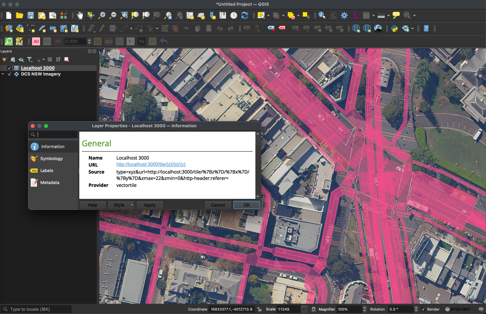
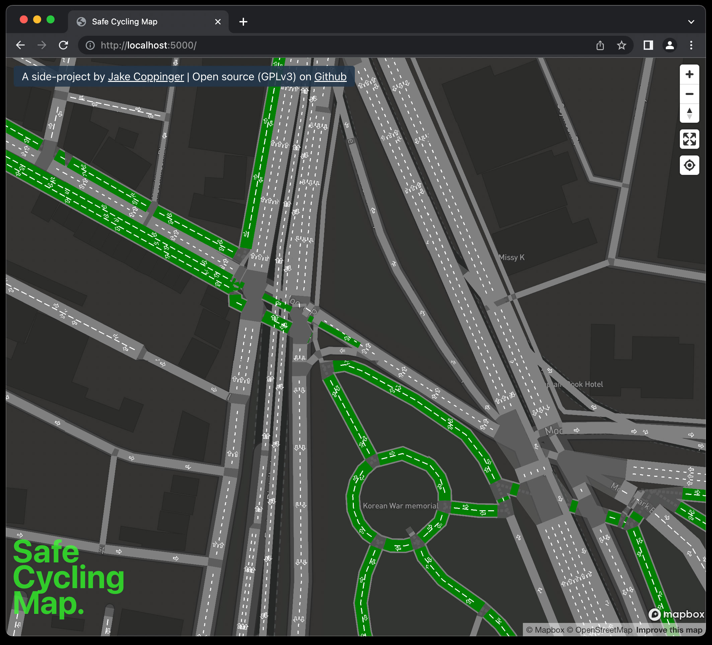

osm2streets vector tileserver
=============================

_This is a work in progress! Loads in QGIS & Mapbox GL JS!_




This is a Typescript Koa webserver that takes vector tile requests
(eg `GET http://localhost:3000/tile/16/60293/39332`) and returns GeoJSON corresponding to the
`osm2streets` output for that tile.

It uses the [NodeJS bindings](https://www.npmjs.com/package/osm2streets-js-node) for a wasm
build of [osm2streets](https://github.com/a-b-street/osm2streets), which itself is written in Rust.


# Running it
## Overpass Turbo
You'll need to stand up your own Overpass Turbo instance - it makes one call for each tile, which
would be too much for the public one (https://overpass-turbo.eu/) unless you're making one call
at a time for debugging.

See https://hub.docker.com/r/wiktorn/overpass-api for instructions. It's one Docker run command!
Make sure to choose your region to not download a map of the entire planet :)

# Running osm2streets vector tileserver
See package.json scripts.

```
nvm use
npm i
npm run build
npm run start
```

# Opening in QGIS
- Run the server as above
- Install the "Vector Tiles Reader" plugin??
- Navigate to Layer menu -> Add Layer -> Add "Vector tile layer"
- Create new vector tile connection with tileserver url like `http://localhost:3000/tile/{z}/{x}/{y}`
- Browse away!

You should see requests hit your command line.

# Architecture / how it works
- takes tileserver requests (eg. http://localhost:3000/tile/16/60293/39332)
- Finds the bounding box of that tile
- Downloads the OSM XML from a local overpass turbo instance for that bounding box
- Calls osm2streets via the NodeJS bindings
- Generates the geojson for all features and combines them
- Caches the output for a given tile zoom/x/y in a JS variable (needs improvement)

# Adding this as a vector tile layer in Mapbox GL JS

Something like this! Work in progress - no styling or separate layers yet.

`"source-layer": "geojsonLayer",` is the crical line - currently `geojsonLayer` is hardcoded in
this repo.

```
map.on("load", function () {
  // See example at
  // https://docs.mapbox.com/mapbox-gl-js/example/multiple-geometries/
  map.addSource("osm2streets-vector-tileserver", {
    type: "vector",
    tiles: ["http://localhost:3000/tile/{z}/{x}/{y}"],
    minzoom: 6, // needs improving
    maxzoom: 22, // needs improving
  });
  map.addLayer({
    id: "osm2streets",
    type: "fill",
    source: "osm2streets-vector-tileserver",
    "source-layer": "geojsonLayer",
    paint: {
      "fill-color": "red",
      "fill-opacity": 0.4,
    },
    filter: ["==", "$type", "Polygon"],
  });
});
```

# Future improvments / PRs you could write :)
- Add guide for how to add vector layor in Mapbox GL JS or another JS frontend
- Fix styles/why are there no colours?
- Improve caching design. There's so much that can be done on this!
  - Every time GeoJSON is generated for a given tile, the GeoJSON is "exact" - so tiles could be
    generated and cached many layers down.
- Clarify the state of overlap between tiles (ie. do we need to apply any lessons from
  https://blog.cyclemap.link/2020-01-25-tilebuffer/ ?
  - I think the Overpass API returns the entire way if a single part of it is in the bounding box,
    so I assume tons of overlap is "built in".

Create an issue or work in progress PR if you start working on something to prevent duplicated
effort.

# Resources

Clipping on vector tiles:
https://blog.cyclemap.link/2020-01-25-tilebuffer/

Mapbox docs on vector tiles:
https://docs.mapbox.com/api/maps/vector-tiles/

Discussion on osm2streets about creating a tileserver:
https://github.com/a-b-street/osm2streets/issues/12

# License
GNU AGPLv3. See LICENSE

# Author
Say hello!
Jake Coppinger (jakecoppinger.com, jake@jakecoppinger.com)
